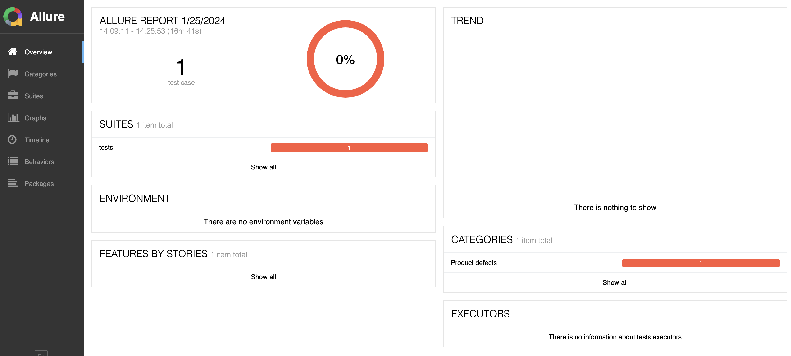

# Test Automation Project

py_automation_demo is implemented using Selenium binding Python (3.) and PyTest framework
The collection of tests contains:
- report temperature tests

## Drivers

Selenium requires a driver to interfere with the chosen browser. Firefox, for example, requires geckodriver, which needs to be installed before the below examples can be run. Make sure it’s in your PATH, e.g., place it in /usr/bin or /usr/local/bin.
Please download the necessary webdriver here (for local run, you only need Chrome and Firefox driver):
- Chrome:	https://sites.google.com/a/chromium.org/chromedriver/downloads
- Edge:	https://developer.microsoft.com/en-us/microsoft-edge/tools/webdriver/
- Firefox:	https://github.com/mozilla/geckodriver/releases
- Safari:	https://webkit.org/blog/6900/webdriver-support-in-safari-10/

Download and Grant permission to downloaded driver:
```
 run command below
1."brew install chromedriver"
2."xattr -d com.apple.quarantine /usr/local/bin/chromedriver"
```

## Project Structure

Here you can find a short description of main directories and it's content
- [action](action) - there are ElementActions of web elements and UIActions of browser/ driver / Web
- [config](config) - there are config of FW. Example: url
- [drivers](drivers) - this directory contains files responsible for configuration, e.g. driver_factory.py for webdriver management
- [contants](contants) - there are locator and value default of test.
- [pages](pages) - there are sets of method for each test step. Base of page object model parttern.
- [tests](tests) - there are sets of tests for main functionalities of website
- [test_data](test_data) - there are data of test.
- [test_output](test_output) - there are summary report after running report_temperature_test.
- [reports](reports) - if you run tests with Allure, tests reports will be saved in this directory.You also using "pytest --html=report.html" for creating another report
- [utils](utils) - this directory contains files responsible for reading input data from json files included in project.

## Project Features

- element and ui actions help for reuseable and easy maintaince code.
- framework follows page object pattern
- data-driven tests - in most tests the option of loading data from an json file has been implemented
- logger has been implemented in each step of test cases, e.g.
- tests can be run on popular browsers - Chrome and Firefox are preconfigured in DriverFactory class and both can be select in [conftest.py](tests/conftest.py), e.g.
- test can be run with headless and unheadless mode.
```
@pytest.fixture()
def setup(request):
    driver_name = request.config.getoption("--driver")
    headless = request.config.getoption("--headless")
    driver = DriverFactory.get_instance().start_driver(driver_name, headless)
```

## Getting Started

To enjoy the automated tests, develop the framework or adapt it to your own purposes, just download the project or clone repository. You need to install packages using pip according to requirements.txt file.
Run the command below in terminal:

```
$ pip3 install -r requirements.txt
```

## Run Automated Tests

- Running with chrome, "no" headless and show report html base on pytest

```
$ pytest tests/report_temperature_test.py --html=report
```

- Running with firefox and "yes" headless 

```
$ pytest tests/login_test.py --driver firefox --headless true --html=report
```

- Running with schedule one hour in a day.
```
$ python3 schedule_test.py
``` 

## Generate Test Report

To generate all tests report using Allure you need to run tests by command first:
```
$ pytest --alluredir=<reports directory path>
```
After that you need to use command:
```
$ allure serve <reports directory path>
```

Report is generated in Chrome browser.

#### **Debugging with python debugger**
**Example:**

Put below lines in test method or class method to debug.
After debugging, press c + Enter to continue
```
import pdb
pdb.set_trace()
```
